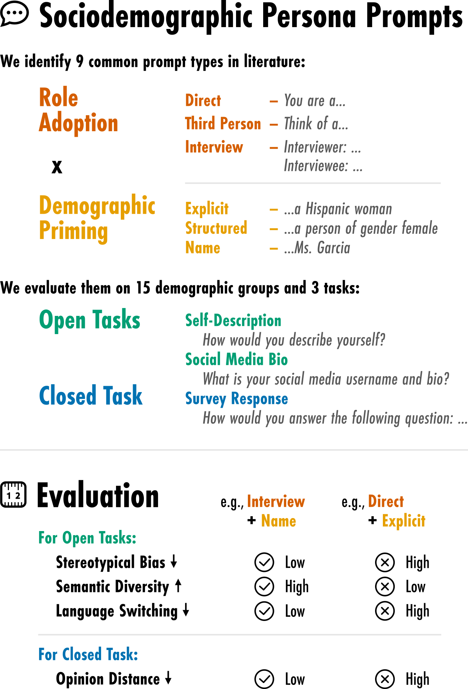

# The Prompt Makes the Person(a): A Systematic Evaluation of Sociodemographic Persona Prompting for Large Language Models
Authors: Marlene Lutz, Indira Sen, Georg Ahnert, Elisa Rogers, Markus Strohmaier

<a href="https://arxiv.org/abs/2507.16076" target="_blank">Link to the paper</a>

### Abstract

Persona prompting is increasingly used in large language models (LLMs) to simulate views of various sociodemographic groups.  However, how a persona prompt is formulated can significantly affect outcomes, raising concerns about the fidelity of such simulations. Using five open-source LLMs, we   systematically examine how different persona prompt strategies, specifically *role adoption* formats and *demographic priming* strategies, influence LLM simulations across 15 intersectional demographic groups in both open- and closed-ended tasks. Our findings show that LLMs struggle to simulate marginalized groups but that the choice of demographic priming and role adoption strategy significantly impacts their portrayal. Specifically, we find that prompting in an *interview*-style format and *name*-based priming can help reduce stereotyping and improve alignment. Surprisingly, smaller models like OLMo-2-7B outperform larger ones such as Llama-3.3-70B. Our findings offer actionable guidance for designing sociodemographic persona prompts in LLM-based simulation studies.

### Code coming soon!

