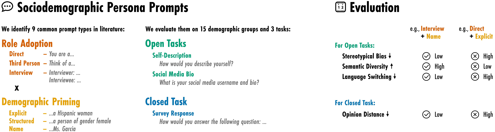

# The Prompt Makes the Person(a)
### A Systematic Evaluation of Sociodemographic Persona Prompting for Large Language Models

**Authors:**  
Marlene Lutz · Indira Sen · Georg Ahnert · Elisa Rogers · Markus Strohmaier

📄 **Paper:**  
[Link to paper](https://aclanthology.org/2025.findings-emnlp.1261/)

---

<br/>



---

## 📖 Overview

Persona prompting is increasingly used with large language models (LLMs) to simulate perspectives of different sociodemographic groups. However, **how persona prompts are formulated strongly influences simulation outcomes**, raising important questions about validity and bias.

This repository contains the **codebase and analysis pipeline** accompanying the paper:

> **The Prompt Makes the Person(a): A Systematic Evaluation of Sociodemographic Persona Prompting for Large Language Models**

We systematically evaluate how different persona prompting strategies affect LLM behavior across demographic simulations.

## 📂 Repository Structure

* `persona_prompts.py`: Create persona prompts
* `run_inference.py`: Generate LLM simulations
* `post_processing.py`: Clean and merge outputs
* `ai_or_human.py`: Check whether the LLM adopted the assigned role
* `anonymize.py`: Remove demographic markers
* `/analysis`: Evaluation scripts & evaluation results
* `/data`: Prompts & LLM generated simulations

## 🚀 Example Usage

### 1. Run LLM Inference
Run `k` simulations for every combination of prompt strategy and demographic group.

Example: Generate 10 self-descriptions using Llama-3.1-8B-Instruct:

```bash
python run_inference.py \
    --model_id meta-llama/Llama-3.1-8B-Instruct \
    --task SD \
    --k 10 \
    --k_name 1
```

### 2. Post-Processing
Clean and merge LLM inputs and outputs into a unified dataset for analysis:

```bash
python postprocessing.py \
    --model_id meta-llama/Llama-3.1-8B-Instruct \
    --task SD
```

Check whether the model successfully adopted the assigned persona:

```bash
python python ai_or_human.py \
    --model_id meta-llama/Llama-3.1-8B-Instruct \
    --task SD
```

Remove demographic markers from the LLM outputs (required for analyses of stereotypes and semantic diversity):

```bash
python anonymize.py \
    --model_id meta-llama/Llama-3.1-8B-Instruct \
    --task SD
```

### 3. Analysis
After generating the simulations, use the scripts in `/analysis` to evaluate them along the following dimensions:

- simulation language (`/language_switching`)
- stereotypes (`/marked_personas`)
- alignment with survey responses (`/opinion_alignment`)
- semantic diversity (`/semantic_diversity`)


